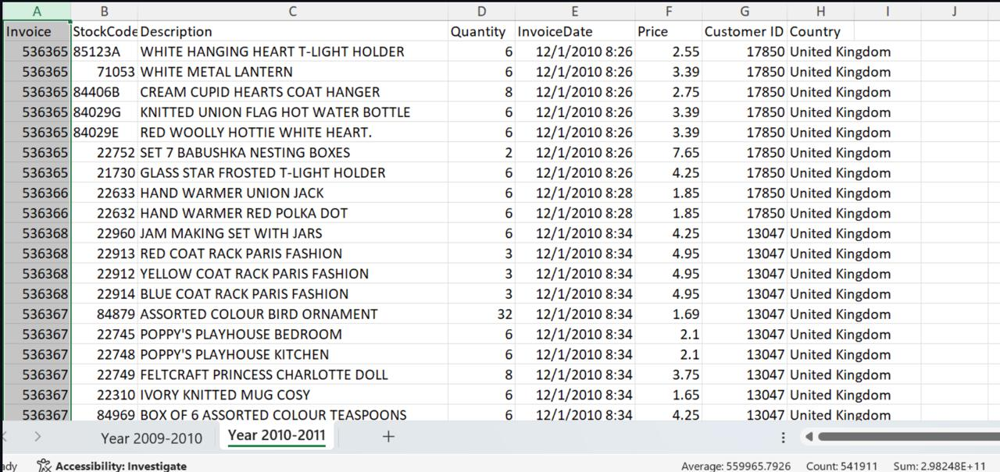

# Retail Sales Analytics – End-to-End Data Pipeline

---

## Introduction

This project presents a complete end-to-end analytics pipeline built using **Python**, **SQL**, and **Power BI** — starting from raw transactional data and concluding with a fully interactive dashboard.

The primary objective was to analyze **customer purchasing behavior**, **overall sales performance**, and **product return trends** by combining structured data processing with business-focused visualization.

---

## Why These Tools?

- **Python** – Used for data extraction, preprocessing, and feature engineering  
- **SQL** – Used to structure, query, and prepare analytical datasets  
- **Power BI** – Used to build an interactive dashboard and present actionable insights  

Although Power BI provides built-in transformation capabilities, Python and SQL were intentionally integrated within a Jupyter environment to simulate a realistic analytics workflow. This approach demonstrates how multiple tools operate together in a modular and scalable data pipeline.

---

## Dataset

This project uses the **Online Retail dataset** from the UCI Machine Learning Repository.

The dataset consists of a single Excel file containing two sheets:

- Year 2009–2010  
- Year 2010–2011  

Both sheets were merged, cleaned, and processed using Python. The cleaned dataset was then queried using SQL, and the resulting analytical tables were used to build the final Power BI dashboard.

### Sample Dataset View

# Part 1: ETL & Data Cleaning with Python
